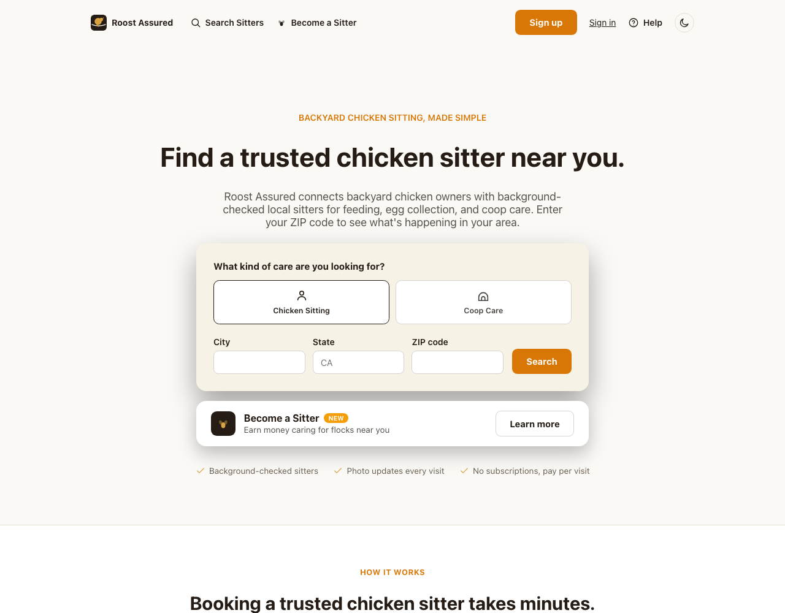
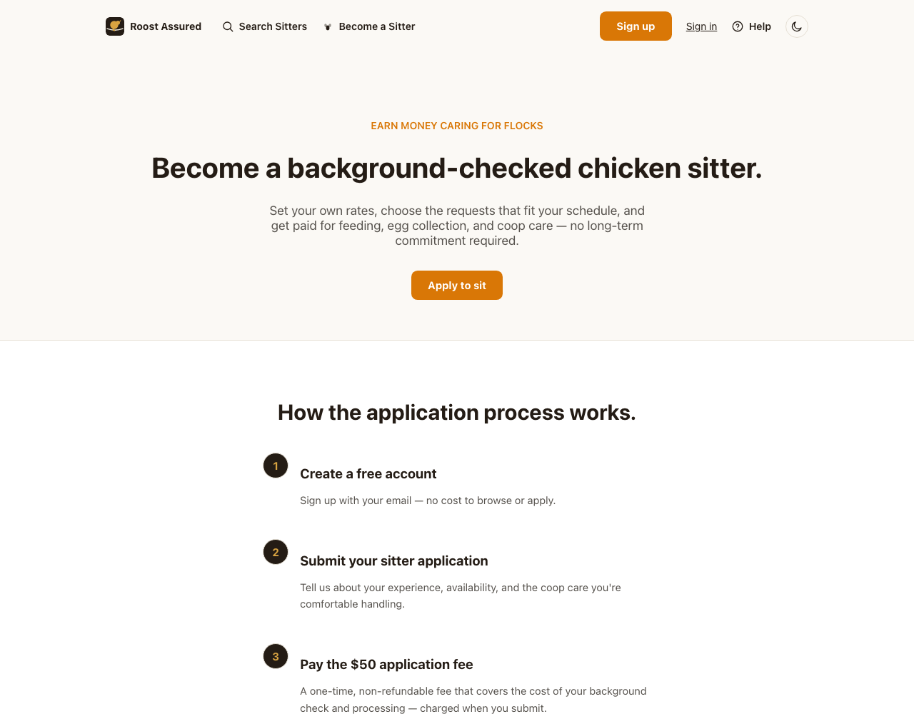
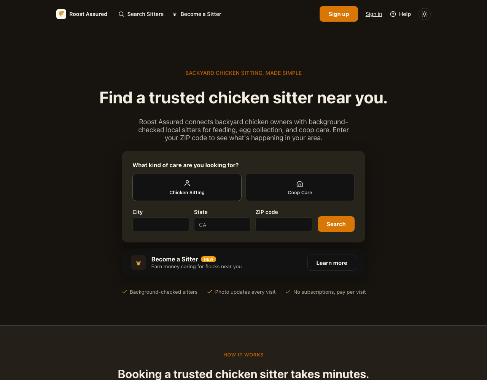

# Roost Assured

A two-sided marketplace for backyard-chicken sitting: owners post a request, nearby
background-checked sitters bid on it, and the platform takes a commission when a bid is accepted.
Rails 8.1 API with a React 19 SPA, Stripe Connect for split payments, and Checkr for background
checks.

**The project is shelved.** It was built to the point where the business question could be
answered honestly, and the answer was no. [`docs/decision_record.md`](docs/decision_record.md)
records what was evaluated and why each option was abandoned — the TAM arithmetic, the
disintermediation problem, the insurance exclusion that made the worst case uninsurable. It is
probably the most useful thing in this repository.

The code is kept public as a work sample. It runs, it is tested, and CI is green.

## Screenshots

| Owner landing page | Sitter recruitment |
|---|---|
|  |  |

The theme is resolved before first paint by a small nonced inline script, so there is no flash of
the wrong palette:



## What's interesting in here

If you are reading this to evaluate the code, these are the parts worth opening:

| Area | Where | Why |
|---|---|---|
| Payment isolation | [`app/controllers/api/received_bids_controller.rb`](app/controllers/api/received_bids_controller.rb) | Accepting a bid reserves, charges, then promotes — in three phases, so an irreversible Stripe charge never sits inside a database transaction |
| Idempotency | [`app/services/stripe_payments/`](app/services/stripe_payments/) | Every Stripe write carries an idempotency key; the bid charge also stamps its payment id into intent metadata so the webhook can't lose a race |
| Webhook handling | [`app/controllers/api/stripe_webhooks_controller.rb`](app/controllers/api/stripe_webhooks_controller.rb) | Signature verification, replay-safe event dedup backed by a unique index, and reconciliation by metadata |
| Geo matching | [`app/models/sitter.rb`](app/models/sitter.rb) | SQL bounding box narrows candidates, exact Haversine decides |
| Content Security Policy | [`config/initializers/content_security_policy.rb`](config/initializers/content_security_policy.rb) | Named third-party origins rather than a blanket `https:`, with a nonce for the one inline script that has to run before first paint |
| Authorization | [`app/models/sitter.rb`](app/models/sitter.rb) (`can_bid_on?`) | Eligibility is enforced on the write path, not inferred from the query that renders the page |

## Stack

- Rails 8.1 (API-only routes under `/api`), PostgreSQL, Solid Queue / Cache / Cable
- React 19 + Vite (`app/frontend`), served same-origin by Rails
- Stripe Connect (Express accounts, destination charges with an application fee)
- Checkr for sitter background checks
- Resend (SMTP) for transactional email
- Deployed on Render — web service, background worker, managed Postgres

## Local development

Requires Ruby (see `.ruby-version`), Node (see `.nvmrc`), and a local PostgreSQL.

```bash
bin/setup
```

That installs dependencies, prepares the database, and starts `bin/dev` (Rails + Vite via
`Procfile.dev`). To set up without starting the server, use `bin/setup --skip-server`.

Copy `.env.example` to `.env` and fill in what you need — the app runs without any third-party
keys, it just can't charge cards, run background checks, or geolocate. Outgoing mail is written to
`tmp/mails` in development.

Seed data is development/test only and includes fictional sitters sharing a well-known password;
`db/seeds.rb` is guarded so this can never run in production.

## Testing and CI

```bash
bin/ci
```

Runs the same steps as [`.github/workflows/ci.yml`](.github/workflows/ci.yml): Rubocop,
bundler-audit, Brakeman, `npm audit`, and the test suite. Individually:

```bash
bin/rails test
```

```bash
npm run lint
```

The Minitest suite covers the Stripe charge flow and its failure modes, authentication and session
expiry, the bid state machine, webhook signature verification and replay, background-check gating,
blocking and reporting, and the geo-matching boundaries. Note that the CSP test renders the real
layout, so it needs built assets — CI runs `bin/vite build` first, and locally `RAILS_ENV=test
bin/vite build` does the same.

## Deploying

[`render.yaml`](render.yaml) is a Render Blueprint that provisions the web service, the Solid Queue
worker, and Postgres. Point **New > Blueprint** at the repo, then set the `sync: false` variables
in the dashboard (`RAILS_MASTER_KEY`, the Stripe keys, the Checkr keys, `RESEND_API_KEY`,
`ADMIN_USERNAME` / `ADMIN_PASSWORD`, `GEOCODER_CONTACT_EMAIL`).

Register the webhook endpoints and copy their signing secrets into the environment:

- Stripe → `https://<host>/api/stripe/webhooks` → `STRIPE_WEBHOOK_SECRET`
- Checkr → `https://<host>/api/checkr/webhooks` → `CHECKR_WEBHOOK_KEY`

## Known limitations

Deliberate scope decisions for a single-operator app that never went to real volume. Each is a
choice rather than an oversight, and each has an obvious next step:

- **Admin auth is a single shared HTTP Basic credential.** It gates the whole admin surface —
  refunds, user PII, sitter approvals, moderation. There is no per-admin identity, so there is no
  answer to "who issued that refund?", and rotating access means a redeploy. Fine for one operator;
  at more than one it wants an `admin` flag on `User` behind the existing session auth, plus an
  audit log of money-moving actions.
- **Active Storage uses a Render disk.** A Render disk attaches to exactly one service, so the web
  service cannot scale past a single instance and the background worker cannot touch attachments.
  Moving to S3 removes both constraints; `config/storage.yml` has the commented configuration.
- **Sitter matching is exact, not approximate.** A bounding box plus in-Ruby Haversine is right for
  hundreds of sitters per metro. At a different order of magnitude this wants PostGIS or the
  `earthdistance` extension so the distance ordering happens in SQL.
- **`PageView` records an IP for every non-API request.** It powers the admin heatmap. IP
  geolocation is off unless `IP_API_KEY` is set, because the free tier has no HTTPS endpoint and
  visitor IPs are not worth sending in the clear.
- **No frontend test suite.** The JSX is linted but not tested; the coverage is on the Rails side,
  where the money and the authorization live.
- **The Checkr flow has no FCRA adverse-action step.** Background checks are requested and their
  results gate approval, but the pre-adverse/adverse-action notices a real deployment would legally
  require are not implemented. This is one of the reasons the project was shelved rather than
  launched — see the decision record.

## License

MIT — see [LICENSE](LICENSE).
